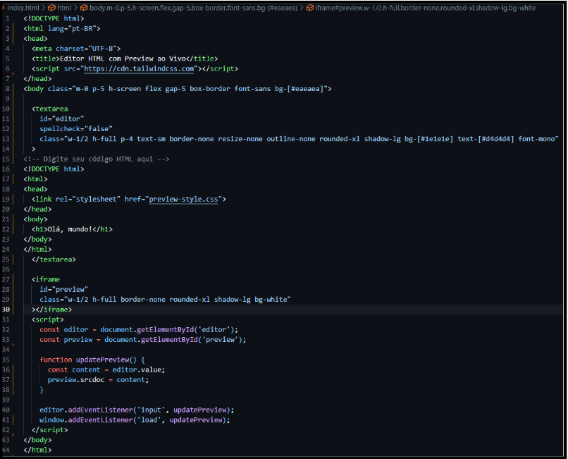
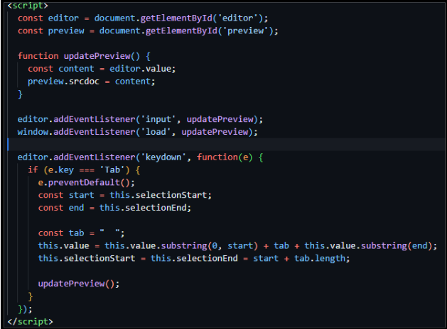
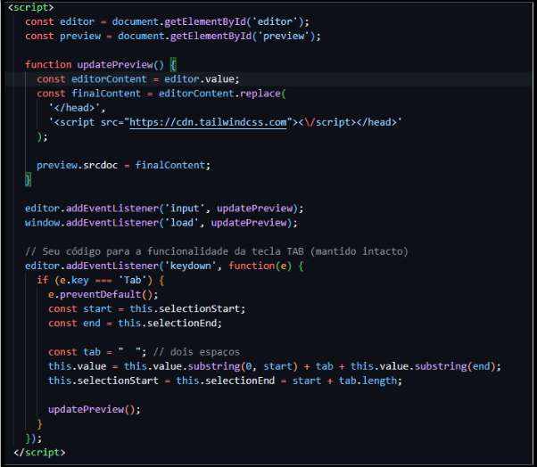
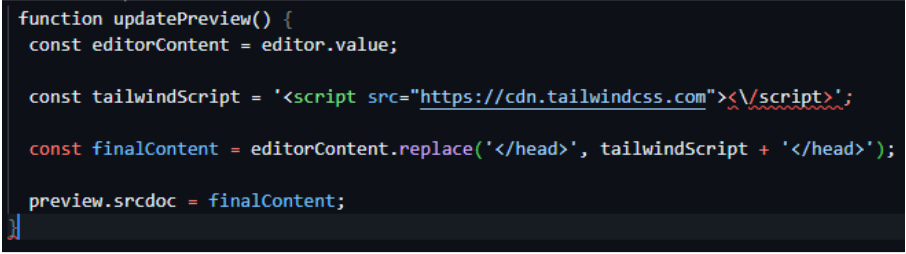
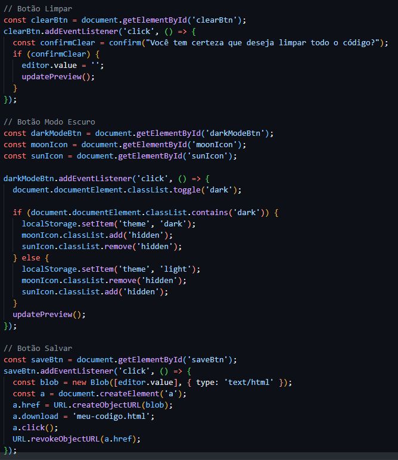
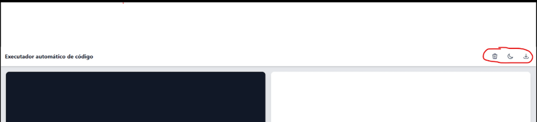

# Mini-Projeto---WEB

    *GRUPO RESPONSAVEL*
        -Pedro Henrique Mendes de Castro
        -Luiz Henrique Pego
        -Cristian Afonso

# Relato de Implementação
Descrição do Objetivo:
	O objetivo do Tailwind CSS é te dar velocidade e controle ao criar interfaces bonitas e responsivas usando apenas classes utilitárias no HTML, sem precisar escrever CSS tradicional (ou escrever muito pouco dele).

Descrição para instalação dos softwares necessários:
	Existem dois modos de instalar o TailwindCSS sendo um para projetos menores como foi utilizado no nosso projeto que e somente inserir no HEAD do programa o seguinte codigo “” desta forma vamos poder utilizar dee maneira basica o Tailwind. Porem para projetos maiores instalamos o da seguinte forma: o Node.js e um requisito necessário,  

1. Crie a pasta do projeto 

2. Inicie um projeto Node
npm init -y

3. Instale Tailwind e dependências
npm install -D tailwindcss postcss autoprefixer

4. Gere os arquivos de configuração
npx tailwindcss init -p

5. Configure o Tailwind
module.exports = {
  content: ["./*.html"],
  theme: {
    extend: {},
  },
  plugins: [],
};

6. Crie um arquivo css com diretivas
@tailwind base;
@tailwind components;
@tailwind utilities;

7. Compile com Tailwind 
npx tailwindcss -i ./style.css -o ./dist/output.css --watch

8. Conecte ele no seu HTML utilizando
"<link rel="stylesheet" href="dist/output.css">"

# Passo-a-Passo para o desenvolvimento:

Primeiro Passo: Criar o arquivo index.html, será o arquivo fonte do nosso projeto

Segundo Passo: Começar a moldar o programa colocando sua funcionalidade principal, essa é a primeira versão do projeto, sem correção de bugs nem funcionalidades extras, somente o código bruto que será usado de base.
    

Terceiro passo: Correção de bugs e aprimoramento do código fonte (inserindo a opção de dar TAB na caixa de edição que antes não era possível). Nosso código já está funcionando mesmo apresentando algumas falhas, porém ele ainda não nos permite usar o tailwind no painel de edição dentro do site, oque é necessário pois esse projeto foi montado com  intuito de usar o painel de modificação para mostrar as funcionalidades do tailwind.
    

Quarto Passo: Permitir que o painel aceite e consiga ler o código com tailwind e o painel de visualização nos mostre o CSS que está sendo inserido no painel de  editor (porém esse método não funcionou, pois existia um erro na “const finalContent = editorContent.replace('</head>', '<script src="https://cdn.tailwindcss.com"><\/script></head>');” 

Quinto Passo: Corrigir o erro e fazer com que o painel aceite e consiga ler o código com tailwind. A solução foi refazer a function updatePreview, criando uma tag de script como uma variável separada.

Sexto Passo: Agora começamos a aprimorar o site visualmente, adicionando alguns botões, barra de navegação, opção para salvar e apagar nosso código, além de poder alternar entre os temas claro e escuro. 

